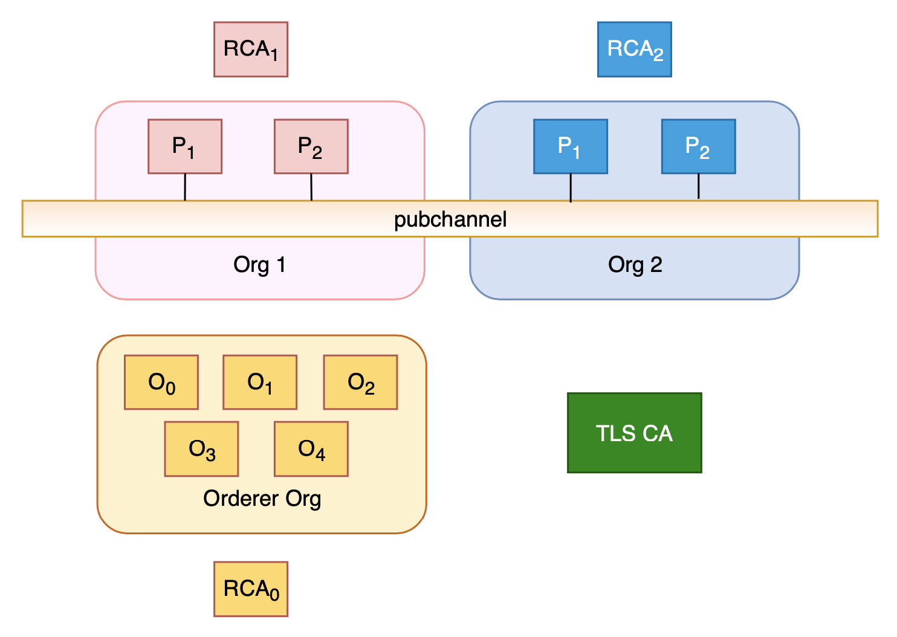

# Hyperledger Fabric 4 CAs Setup

`Fabric operation guide` : <https://hyperledger-fabric-ca.readthedocs.io/en/latest/operations_guide.html>

Prerequsites: docker and docker-compose

***

## Topology



***

## Setup Fabric Network

To start the network, run the start command.

```bash
./start.sh
```

```console
2020-03-13 09:42:13.460 UTC [channelCmd] InitCmdFactory -> INFO 001 Endorser and orderer connections initialized
2020-03-13 09:42:13.475 UTC [channelCmd] update -> INFO 002 Successfully submitted channel update
Complete update anchor peer for WakandaGov


####
####  Fabric network started!
####
```

***

## Install and instaniate chaincode

```bash
./installcc.sh
```

***

## Clean Up

If everything is good, we can clean up the environment. :tada::tada:

```bash
./cleanup.sh
```
